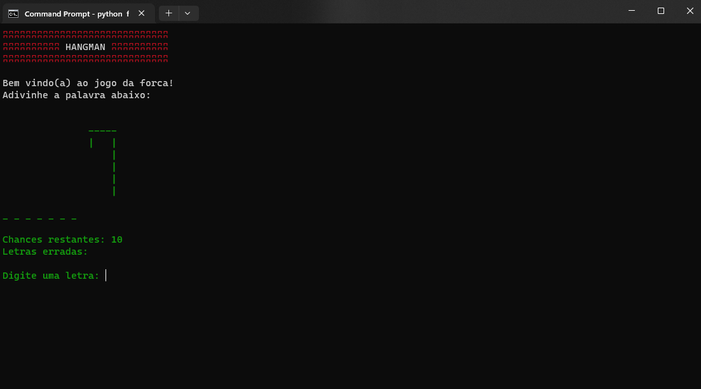

## Just run the game with Python script

```batch
python forca.py
```


🕹️Na versão final do jogo, a classe Hangman encapsula todas as funções e variáveis relacionadas ao jogo da forca. 
🐍O método **__init__** é o construtor da classe, que inicializa todas as variáveis necessárias. 
💡O método game contém a lógica principal do jogo. 


